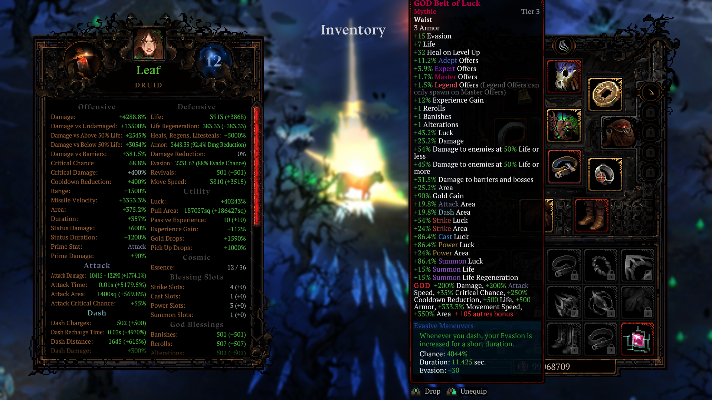

# Death Must Die : éditeur d'objets (DMD Item Editor)

Plugin BepInEx qui ajoute au jeu une fenêtre (touche **F8**) pour modifier n'importe quel objet en direct :
rareté, tier, base, affixes (tous les ~550 affixes du jeu, sur n'importe quel emplacement, avec n'importe
quel nombre de niveaux), création d'objets, don d'uniques, duplication et suppression.

Testé sur Death Must Die buildid Steam 21650210 (Unity 2021.3.11, Mono x64) avec BepInEx 5.4.23.5.

## En jeu

Une ceinture Mythic portant le **GOD affix** (niveau 500), vue dans l'inventaire du jeu : la ligne GOD apparaît
dans l'infobulle native et les statistiques du personnage à gauche reflètent les bonus.



## Installation (joueurs)

1. Télécharger `DMDItemEditor-<version>.zip` (il contient BepInEx 5, sa configuration et le plugin).
2. Dans Steam : clic droit sur Death Must Die > Gérer > Parcourir les fichiers locaux.
3. Extraire tout le contenu du zip dans ce dossier, à côté de `Death Must Die.exe`.
4. Lancer le jeu et appuyer sur **F8**.

Les détails (dépannage, désinstallation) sont dans [LISEZMOI.txt](LISEZMOI.txt), inclus dans le zip.
Si BepInEx 5 est déjà installé, `DMDItemEditor-<version>-plugin-only.zip` suffit, avec le réglage du point 3 ci-dessous.

## Installation manuelle

1. Installer [BepInEx 5 x64](https://github.com/BepInEx/BepInEx/releases) dans le dossier du jeu
   (là où se trouve `Death Must Die.exe`), voir la
   [documentation officielle](https://docs.bepinex.dev/master/articles/user_guide/installation/unity_mono.html).
2. Lancer le jeu une fois puis le fermer, pour que BepInEx crée `BepInEx\config\BepInEx.cfg`.
3. **Obligatoire** : dans `BepInEx\config\BepInEx.cfg`, passer `HideManagerGameObject = true`.
   Sans ça, le jeu détruit l'objet de BepInEx au chargement et aucun plugin ne reçoit `Update`/`OnGUI`.
4. Copier `DMDItemEditor.dll` dans `BepInEx\plugins\DMDItemEditor\`.

Sauvegarde d'abord `%USERPROFILE%\AppData\LocalLow\Realm Archive\Death Must Die\Saves\`.

## Utilisation

- **F8** ouvre ou ferme l'éditeur (les contrôles du jeu sont bloqués tant qu'il est ouvert).
- Onglets **Équipé / Sac / Coffre 1-4 / Bibliothèque / Tous** : choisir un objet à gauche, le modifier à droite.
  Les objets équipés sont réappliqués automatiquement (stats et capacités recalculées).
- Onglet **Créer** : choisir une base pour créer un brouillon, l'éditer, puis l'ajouter au sac ou au coffre.
  La liste des uniques permet de les donner tels quels ou de les éditer avant de les donner.
- Onglet **Butin** : règle le butin des monstres (désactivé par défaut, réglages gardés entre les parties).
  - Taux : drop garanti, multiplicateur de chance de drop, nombre d'objets par drop (x1 à x20).
  - Qualité : raretés autorisées (tirage égal entre les cases cochées), tier forcé T1 à T5,
    chance d'objet unique en %.
  - Nombre d'affixes exact des objets normaux droppés (jusqu'à 30) : les affixes manquants sont des
    affixes de stats tirés au hasard, au maximum de leur valeur.
  - Chance qu'un drop porte le **GOD affix** (voir plus bas).
  - **Simuler 200 monstres tués** fait tourner le vrai générateur du jeu avec ces réglages et affiche
    la répartition obtenue, sans rien donner.
  - Les uniques n'existent qu'en T1 à T3 et ne tombent qu'au tier de l'acte. Les uniques Immortal sont
    réservés aux événements, donc un tirage Immortal donne un Mythic.
- **GOD affix** : un vrai affixe ajouté au jeu par le mod, qui cumule les effets des 113 affixes de stats
  positifs (dégâts, vitesse, critique, vie, armure, zone, chance, vitesse de déplacement...). N niveaux de GOD
  donnent N niveaux de chacun. Au niveau 500 (défaut) : environ +200 % de dégâts, +200 % de vitesse d'attaque,
  +35 % de critique, +500 PV et 105 autres bonus. Il s'ajoute depuis l'éditeur (bouton « ★ Ajouter GOD »),
  depuis la liste des affixes, ou sur les drops. L'onglet Butin montre un aperçu de son infobulle.
  - Les nombres de projectiles, rebonds, perforations et invocations sont exclus par défaut car ils peuvent
    faire ramer le jeu (`GodAffix.IncludeProjectileCounts`, redémarrage nécessaire).
  - **Attention** : si le mod est retiré, le jeu supprime au chargement les objets qui portent GOD.
    Retire GOD de tes objets avant de désinstaller.
- **Sauvegarder la partie** force une sauvegarde immédiate (le jeu sauvegarde aussi de lui-même).

### Limites qui restent
- Rareté (Broken à Immortal) et tier (T1 à T5) restent dans les bornes du jeu : il indexe des tableaux avec.
- La base d'un objet **équipé** ne peut être remplacée que par une base du même emplacement ;
  déséquipe-le pour changer d'emplacement.
- Les uniques modifiés gardent leurs modifications grâce au patch du plugin. Si le plugin est retiré,
  le jeu les reconstruit depuis leur modèle d'origine (la sauvegarde reste valide).

## Configuration (`BepInEx\config\vieuxnorris.dmd.itemeditor.cfg`)

| Clé | Défaut | Rôle |
|---|---|---|
| `General.ToggleKey` | `F8` | Touche d'ouverture |
| `General.UiScale` | `1` | Échelle de la fenêtre (0.5 à 3) |
| `Items.PersistUniqueEdits` | `true` | Garder les modifications des uniques au chargement |
| `Items.DefaultAffixLevels` | `10` | Niveaux par défaut d'un affixe ajouté |
| `Loot.*` | désactivé | Réglages de l'onglet Butin (modifiables aussi à la main) |
| `GodAffix.DefaultLevels` | `500` | Niveau du GOD affix ajouté |
| `GodAffix.IncludeProjectileCounts` | `false` | Inclure projectiles, rebonds, invocations dans GOD |

## Compiler

Prérequis : .NET SDK 8, le jeu et BepInEx installés.

```bash
dotnet build src/DMDItemEditor -c Release -p:GameDir="G:\Steam\steamapps\common\Death Must Die"
```

La DLL est copiée automatiquement dans `BepInEx\plugins\DMDItemEditor\` si BepInEx est présent.

Pour produire les zips de distribution dans `dist/` (fonctionne aussi jeu lancé, sans redéployer) :

```bash
pwsh tools/package.ps1
```

## Comment ça marche

- Les objets (`Death.Items.Item`) ont des propriétés en lecture seule : le plugin écrit leurs champs de
  stockage via Harmony `AccessTools.FieldRefAccess`, ce qui garde la même instance partout (dépôt d'objets,
  emplacements, équipements).
- Après une modification, chaque `ItemSlot` qui contient l'objet déclenche `OnChangeEv(item, item)` :
  `EquipmentAbilityTracker` retire puis recrée les capacités à partir des nouveaux affixes.
- Le patch `ItemSaveLoad.TryLoadFrom` garde les affixes, la rareté et le tier sauvegardés des uniques,
  que le jeu remplace sinon par ceux du modèle.
- L'éditeur est un panneau IMGUI dessiné avec `GUI.depth = 10`, pas une `GUI.Window` : Unity peint les
  fenêtres après tout le reste, ce qui cachait le curseur du jeu (dessiné par `CursorManager.OnGUI`).
  Le curseur du jeu reste ainsi au-dessus de l'éditeur.
- Butin : un préfixe sur `LootGenerator.ReGenerateWithDropChance` applique le taux, un postfixe sur
  `LootGenerator.ReGenerate` réécrit les recettes (raretés, tier, chance d'unique) et les duplique.
  `ItemGenerator.PickRandomRarity` est contourné pour ces recettes seulement, sinon le plafond de rareté
  du jeu pourrait vider le tirage. La boutique n'est pas touchée.
- GOD : un postfixe sur `Database.Init` ajoute à `ItemAffixesTable` un `ItemAffix` dont le tableau
  `Abilities` est la concaténation de celles des affixes de stats (même `StatGroup` que Damage %). Le texte
  d'infobulle passe par un préfixe sur `LocalizationManager.GetAffixDescr`. Le nombre d'affixes et GOD sur
  les drops sont appliqués par un postfixe sur `ItemGenerator.Generate`, pour les recettes du butin uniquement.
- Notes de reverse détaillées : [MODDING_PLAN.md](MODDING_PLAN.md). Scripts d'analyse dans `tools/`.
